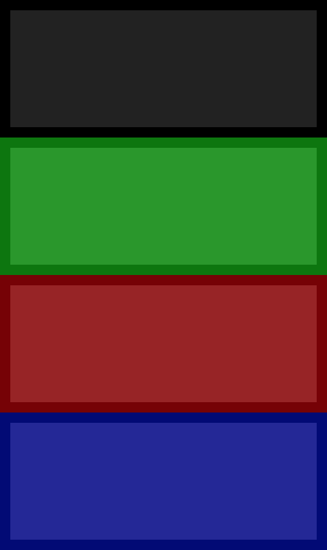

# Le jeu des boîtes

De quoi travailler le responsive design avec Bootstrap (version 4) :smiley:

## Instructions

* Les boîtes doivent être placées les unes sous les autres (sur 4 lignes). C'est le comportement par défaut que vous avez en accédant à la page après avoir cloné le repo.



* à partir du breakpoint `small` :
  + les boîtes doivent être affichées sur deux lignes, avec deux boites par ligne (2 colonnes par ligne).
  + la boîte noire et la boîte verte doivent échanger leurs places.


* à partir du breakpoint `medium` :
  + la boîte noire doit disparaître
  + les autres boîtes doivent se placer à côté les unes des autres (3 colonnes sur une ligne).


* à partir du breakpoint `large` :
  + la boîte noire doit apparaitre à nouveau
  + les 4 boîtes sont dorénavant toutes à côté les unes des autres (4 colonnes sur une ligne).


### Spoiler 1 : démarrer

<details>

Après avoir lié [la CSS de Bootstrap](https://getbootstrap.com/docs/4.0/getting-started/introduction/), ne pas oublier la balise meta permettant de prendre en compte la largeur du périphérique :

```html
<meta name="viewport" content="width=device-width, initial-scale=1">
```

</details>

### Spoiler 2 : les breakpoints

<details>

- Voir `Grid > Responsive classes`

</details>

### Spoiler 3 : masquage et décalage

<details>

- Voir `Utilities > Display > Hiding elements`
- Voir `Utilities > Flex > Order` ou `Layout > Grid > Reordering`

</details>
